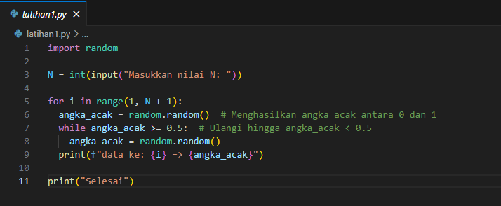
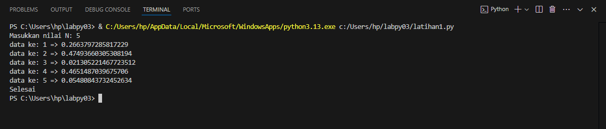
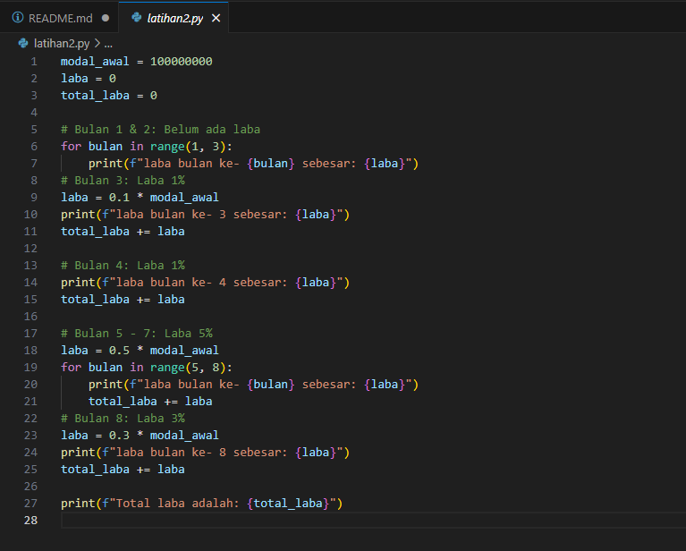
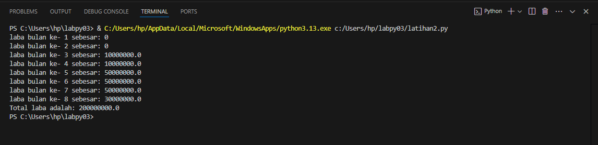
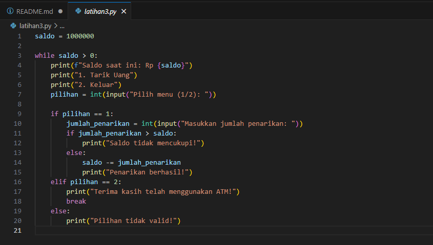
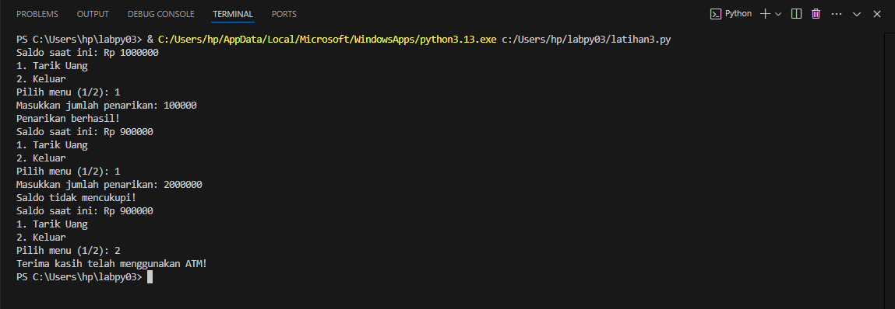

# TUGAS PRATIKUM PERULANGAN

### Latihan 1: latihan1.py
1.	Tampilkan n bilangan acak yang lebih kecil dari 0.5.
2.	nilai n diisi pada saat runtime.
3.	anda bisa menggunakan kombinasi while dan for untuk menyelesaikannya.
4.	gunakan fungsi random() yang dapat diimport terlebih dahulu.

**Contoh kode program Python3 (Vs Code)**
**Contoh Input**

 

# Python
     import random

     N = int(input("Masukkan nilai N: "))

     for i in range(1, N + 1):
         angka_acak = random.random()  # Menghasilkan angka acak antara 0 dan 1
          while angka_acak >= 0.5:  # Ulangi hingga angka_acak < 0.5
         angka_acak = random.random()
     print(f"data ke: {i} => {angka_acak}")

 print("Selesai")
 
**Penjelasan Kode:**
1.	import random: Mengimpor modul random yang berisi fungsi untuk menghasilkan angka acak.
2.	N: Menerima input dari pengguna untuk menentukan jumlah bilangan acak (N) yang ingin ditampilkan. 
3.	for i in range(1, N + 1): Pengulangan for untuk mengulang proses sebanyak yang di input ke variabel N.
4.	angka_acak = random.random(): Menghasilkan angka acak antara 0 dan 1 menggunakan fungsi random.random() dan menyimpannya dalam variabel angka_acak.
5.	while angka_acak >= 0.5: Pengulangan while untuk memastikan angka acak yang dihasilkan kurang dari 0.5. Jika angka_acak lebih besar atau sama dengan 0.5, maka akan di-generate angka acak baru hingga kondisinya terpenuhi.
6.	print(f"data ke: {i} => {angka_acak}"): Menampilkan angka acak yang telah dihasilkan. f-string digunakan untuk memudahkan format output.
7.	print("Selesai"): Menampilkan pesan "Selesai" setelah loop selesai.

**Contoh Output dengan nilai dari N = 5**

 

### Latihan 2: latihan2.py 
Seorang pengusaha menginvestasikan uangnya untuk memulai usahanya dengan modal awal 100 juta, pada bulan pertama dan kedua belum mendapatkan laba. pada bulan ketiga baru mulai mendapatkan laba sebesar 1% dan pada bulan ke 5, pendapatan meningkat 5%, selanjutnya pada bulan ke 8 mengalami penurunan keuntungan sebesar 2%, sehingga laba menjadi 3%. Hitung total keuntungan selama 8 bulan berjalan usahanya.

**Contoh kode program Python3 (Vs Code)**
**Contoh Input**

 

**Penjelasan Kode:**
1.	Inisialisasi variabel:
 * modal_awal = 100000000: Mendefinisikan modal awal sebesar 100 juta.
 * laba = 0: Menetapkan variabel laba awal dengan nilai 0.
 * total_laba = 0: Menetapkan variabel total_laba awal dengan nilai 0.
2.	Perulangan untuk bulan 1 & 2 (tidak ada laba):
 * for bulan in range(1, 3):: Melakukan iterasi untuk bulan 1 dan 2.
 * print(f"laba bulan ke- {bulan} sebesar: {laba}"): Menampilkan laba bulan ke-1 dan ke-2 yang masih 0.
3.	Hitung dan tampilkan laba bulan ke-3 (laba 1%):
 * laba = 0.1 * modal_awal: Menghitung laba bulan ke-3 (1% dari modal awal).
 * print(f"laba bulan ke- 3 sebesar: {laba}"): Menampilkan laba bulan ke-3.
 * total_laba += laba: Menambahkan laba bulan ke-3 ke total_laba.
4.	Hitung dan tampilkan laba bulan ke-4 (laba 1%):
 * print(f"laba bulan ke- 4 sebesar: {laba}"): Menampilkan laba bulan ke-4 (sama dengan bulan ke-3).
 * total_laba += laba: Menambahkan laba bulan ke-4 ke total_laba.
5.	Looping untuk bulan 5-7 (laba 5%):
 * laba = 0.5 * modal_awal: Menghitung laba bulan ke-5 hingga ke-7 (5% dari modal awal).
 * for bulan in range(5, 8):: Melakukan iterasi untuk bulan 5, 6, dan 7.
 * print(f"laba bulan ke- {bulan} sebesar: {laba}"): Menampilkan laba untuk setiap bulan.
 * total_laba += laba: Menambahkan laba setiap bulan ke total_laba.
6.	Hitung dan tampilkan laba bulan ke-8 (laba 3%):
 * laba = 0.3 * modal_awal: Menghitung laba bulan ke-8 (3% dari modal awal).
 * print(f"laba bulan ke- 8 sebesar: {laba}"): Menampilkan laba bulan ke-8.
 * total_laba += laba: Menambahkan laba bulan ke-8 ke total_laba.
7.	Menampilkan total laba:
 * print(f"Total laba adalah: {total_laba}"): Menampilkan total laba selama 8 bulan.

**Contoh Output dengan hasil laba selama 8 bulan = 200000000/200 juta**

 

### Latihan 3: latihan3.py 
Buat program yang mensimulasikan mesin ATM sederhana. Pengguna memiliki saldo awal sebesar Rp 1.000.000, dan dapat menarik uang hingga saldo habis atau memilih untuk keluar.

**Contoh kode program Python3 (Vs Code)**
**Contoh Input**

 
 
**Penjelasan kode:**
1.	Inisialisasi saldo:
 * saldo = 1000000: Menetapkan saldo awal sebesar Rp 1.000.000.
2.	Pengulangan while:
 * while saldo > 0: Pengulangan akan terus berjalan selama saldo masih lebih besar dari 0.
3.	Menampilkan menu dan menerima input:
 * print(f"Saldo saat ini: Rp {saldo}"): Menampilkan saldo saat ini.
 * print("1. Tarik Uang"): Menampilkan pilihan menu pertama.
 * print("2. Keluar"): Menampilkan pilihan menu kedua.
 * pilihan = int(input("Pilih menu (1/2): ")): Menerima input pilihan menu dari pengguna dan mengubahnya menjadi integer.
4.	Memproses pilihan menu:
 * if pilihan == 1: Jika pengguna memilih menu 1 (Tarik Uang): 
     * jumlah_penarikan = int(input("Masukkan jumlah penarikan: ")): Menerima input jumlah penarikan dari pengguna.
     * if jumlah_penarikan > saldo: Jika jumlah penarikan melebihi saldo, tampilkan pesan "Saldo tidak mencukupi!".
     * else: Jika saldo mencukupi: 
     * saldo -= jumlah_penarikan: Kurangi saldo dengan jumlah penarikan.
     * print("Penarikan berhasil!"): Tampilkan pesan "Penarikan berhasil!".
 * elif pilihan == 2: Jika pengguna memilih menu 2 (Keluar): 
     * print("Terima kasih telah menggunakan ATM!"): Tampilkan pesan "Terima kasih telah menggunakan ATM!".
     * break: Keluar dari Pengulangan while.
 * else: Jika pengguna memasukkan pilihan selain 1 atau 2: 
     * print("Pilihan tidak valid!"): Tampilkan pesan "Pilihan tidak valid!".

**Contoh Output Penggunaan**
 

